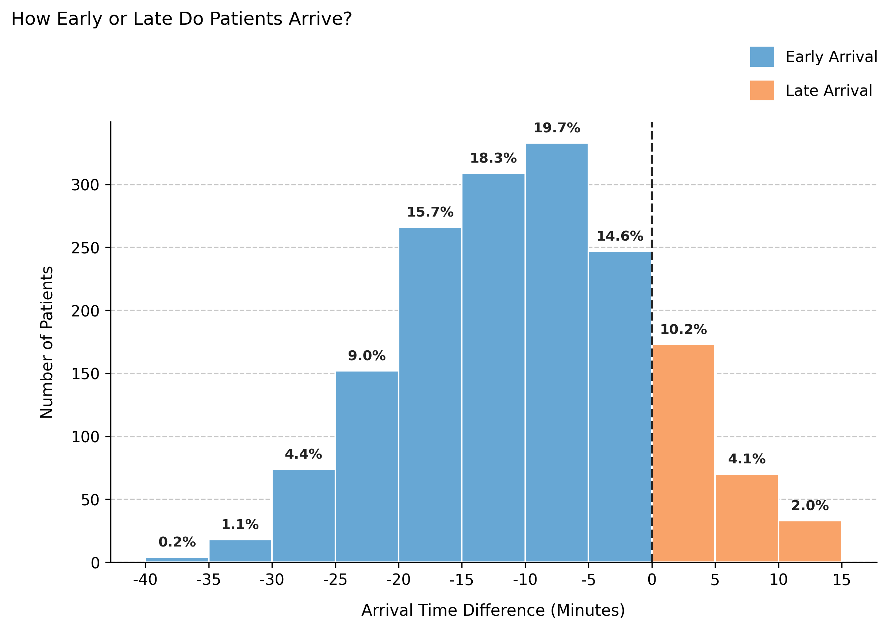

# Appointment Timing and Daily Flow

## Overview  
The timing parameters **`check_in_time_mean`** and the internal **appointment duration model** define how early patients arrive and how long visits last.  
Together, they determine the **temporal flow** of the simulated clinic — when patients arrive, how long they wait, and how consultations overlap throughout the day.

You will explore:
1. Typical punctuality and consultation duration patterns.  
2. How late arrivals affect clinic flow and waiting times.  
3. How early arrivals can improve coordination and reduce delays.

---

## Example 1 – Standard punctuality and consultation time  
A typical outpatient clinic where most patients arrive slightly early and sessions last around 15–20 minutes.

```python
from medscheduler import AppointmentScheduler
from medscheduler.utils.plotting import (
    plot_arrival_time_distribution,
    plot_waiting_time_distribution,
    plot_appointment_duration_distribution
)

sched_standard = AppointmentScheduler(
    date_ranges=[("2024-01-01", "2024-03-31")],
    ref_date="2024-03-15",
    check_in_time_mean=-10,  # average 10 min early
    fill_rate=0.85
)

slots_df, appts_df, patients_df = sched_standard.generate()

# Visualizations
plot_arrival_time_distribution(appts_df)
plot_waiting_time_distribution(appts_df)
```

**Output preview:**  
Below are the main visualizations for this baseline scenario:

1. **Arrival time distribution** – Most patients check in between 5–15 minutes early.  
   

2. **Waiting time distribution** – Median waiting ≈ 5 minutes, showing efficient flow.  
   

---

## Appointment duration model (internal behavior)

The simulator assigns consultation durations to **attended** visits using a fixed stochastic model — not a user parameter — ensuring realistic variability in service length.

```python
# Visualize the internal appointment duration model
plot_appointment_duration_distribution(appts_df)
```

**Output preview:**  
**Appointment duration distribution** – The internal Beta(1.48, 3.6) model produces realistic session lengths (mean ≈17 min, median ≈16 min).  


**Explanation:**  
- Durations follow a **Beta(1.48, 3.6)** distribution scaled to 0–60 min.  
- This yields short right-skewed sessions with typical times between **10 – 25 min**.  
- Derived from *Tai-Seale et al. (2007)*, these values approximate observed patterns in primary care.  

This distribution interacts with arrival times to shape overall waiting patterns — even when punctuality is ideal, short or long sessions can affect subsequent delays.

---

## Example 2 – Frequent late arrivals  
A clinic where patients often arrive after their scheduled time, causing downstream delays.

```python
sched_late = AppointmentScheduler(
    date_ranges=[("2024-01-01", "2024-03-31")],
    ref_date="2024-03-15",
    check_in_time_mean=5,   # average 5 min late
    fill_rate=0.85
)

slots_df, appts_df, patients_df = sched_late.generate()

plot_arrival_time_distribution(appts_df)
plot_waiting_time_distribution(appts_df)
```

**Output preview:**  

1. **Arrival time distribution** – Skewed toward later arrivals, showing frequent tardiness.  
   

2. **Waiting time distribution** – Broader and asymmetric, as delays accumulate downstream.  
   

**Interpretation:**  
When patients arrive late on average, waiting times become irregular and less predictable.  
This scenario represents real clinics struggling with punctuality compliance, where even minor delays propagate through the day.

---

## Example 3 – High-efficiency morning clinic  
A tightly managed setting where patients arrive well in advance, minimizing idle time between consultations.

```python
sched_fast = AppointmentScheduler(
    date_ranges=[("2024-01-01", "2024-03-31")],
    ref_date="2024-03-15",
    check_in_time_mean=-15,  # very early arrivals
    fill_rate=0.9
)

slots_df, appts_df, patients_df = sched_fast.generate()

plot_arrival_time_distribution(appts_df)
plot_waiting_time_distribution(appts_df)
```

**Output preview:**  

1. **Arrival time distribution** – Concentrated around −15 minutes, most patients early.  
   

2. **Waiting time distribution** – Lower median wait (< 3 min) due to synchronized readiness.  
   

**Interpretation:**  
Early arrivals and steady throughput yield minimal idle time and consistent session flow.  
This configuration suits high-volume diagnostics or vaccination sessions where speed and regularity are prioritized.

---

## Summary  
| Scenario | `check_in_time_mean` | Behavior | Typical waiting time | Operational impact |
|-----------|----------------------|-----------|----------------------|------------------|
| **Standard** | −10 min | Early punctuality | ~5 min | Balanced and efficient |
| **Late arrivals** | +5 min | Patients often delayed | >10 min | Variable and delayed |
| **Fast clinic** | −15 min | Very early arrivals | <3 min | Smooth and consistent |

---

### Notes  
- **Arrival-time patterns** directly control waiting-time distributions.  
- Appointment durations are fixed by the internal **Beta(1.48, 3.6)** model, independent of punctuality.  
- Flow stability depends on the interaction between punctuality, duration variability, and fill rate.  

---

### Next Steps  
- Examine {doc}`../api-reference/appointments_table` for time variables.  
- Review {doc}`../api-reference/randomness_and_noise` to understand stochastic components.  
- Explore {doc}`../api-reference/attendance_behavior` to connect punctuality with attendance outcomes.  
- Revisit {doc}`patient_flow_demographics` to analyze how demographic traits affect punctuality trends.


