# Attendance Behavior and Rebooking Scenarios

## Overview  
Once appointments are generated, not all patients attend.  
Some cancel, others miss their visit entirely, and some are rebooked.  
The parameters **`status_rates`** and **`rebook_category`** jointly control these post-booking behaviors, shaping the realism of appointment outcomes over time.

You will explore three practical scenarios:
1. A balanced system with typical attendance and partial rebooking.  
2. A no-rebooking system representing rigid scheduling (lost cancellations).  
3. A highly adaptive system with full rebooking and low non-attendance.  

Each scenario shows how these parameters modify attendance outcomes and day-to-day clinic activity.

---

## Example 1 – Balanced outpatient attendance (default behavior)
A standard clinic using NHS-derived attendance proportions and 50% rebooking intensity.

```python
from medscheduler import AppointmentScheduler
from medscheduler.utils.plotting import (
    plot_appointments_by_status,
    plot_appointments_by_status_future,
    plot_status_distribution_last_days,
    plot_status_distribution_next_days,
)
import pandas as pd

sched_default = AppointmentScheduler(
    date_ranges=[("2024-01-01", "2024-12-31")],
    ref_date="2024-11-25",
    fill_rate=0.85,
    rebook_category="med"
)

slots_df, appts_df, patients_df = sched_default.generate()

# Visualizations
plot_appointments_by_status(appts_df, scheduler=sched_default)
plot_appointments_by_status_future(appts_df, scheduler=sched_default)
plot_status_distribution_last_days(appts_df, scheduler=sched_default, days_back=21)
plot_status_distribution_next_days(appts_df, scheduler=sched_default, days_ahead=21)
```

**Output preview:**  
Below are the four main outputs for this configuration:

1. **Past appointment outcomes** – Proportion of attended, cancelled, and missed visits before the reference date.  
   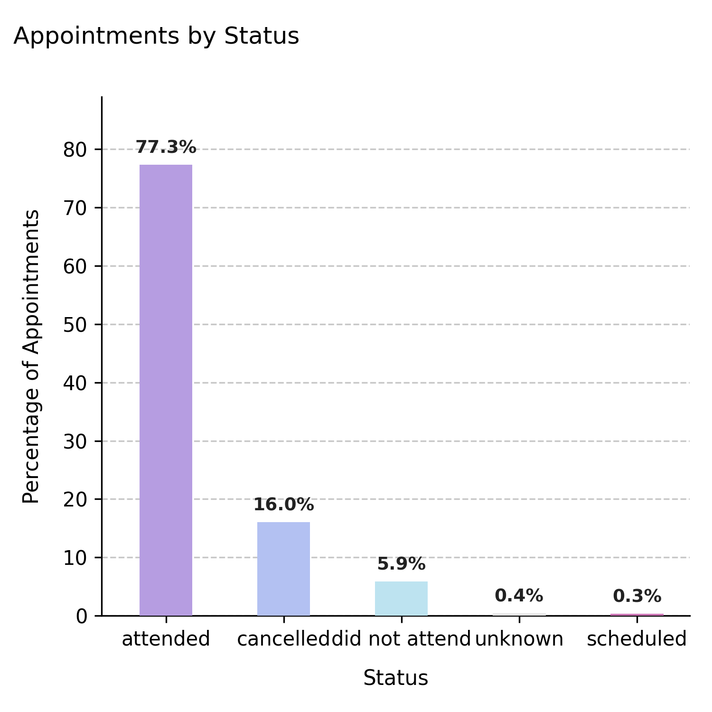

2. **Future appointment outcomes** – Expected proportions for upcoming appointments.  
   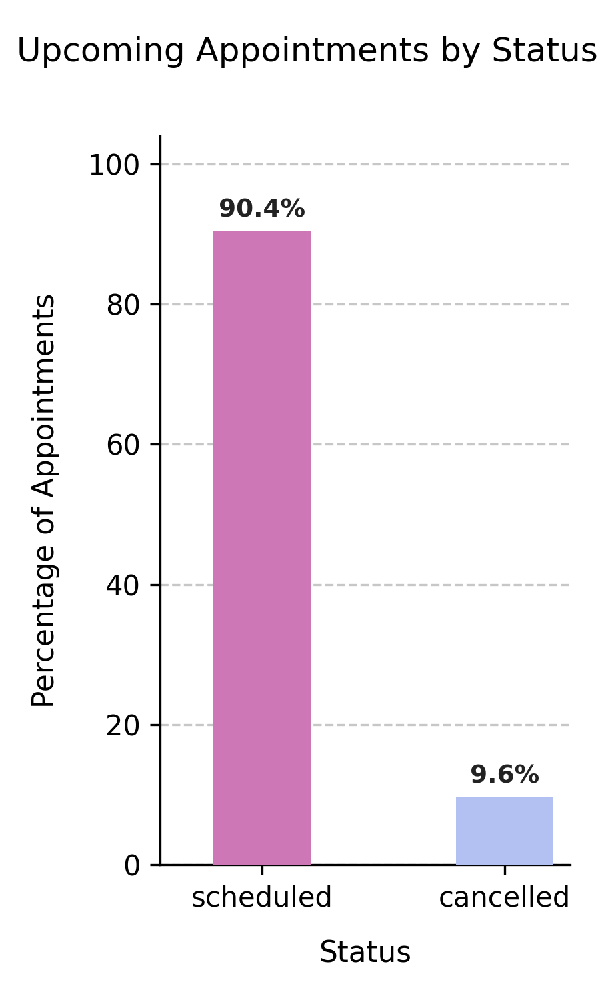

3. **Recent daily activity (past 21 days)** – Trends in attended vs. missed appointments.  
   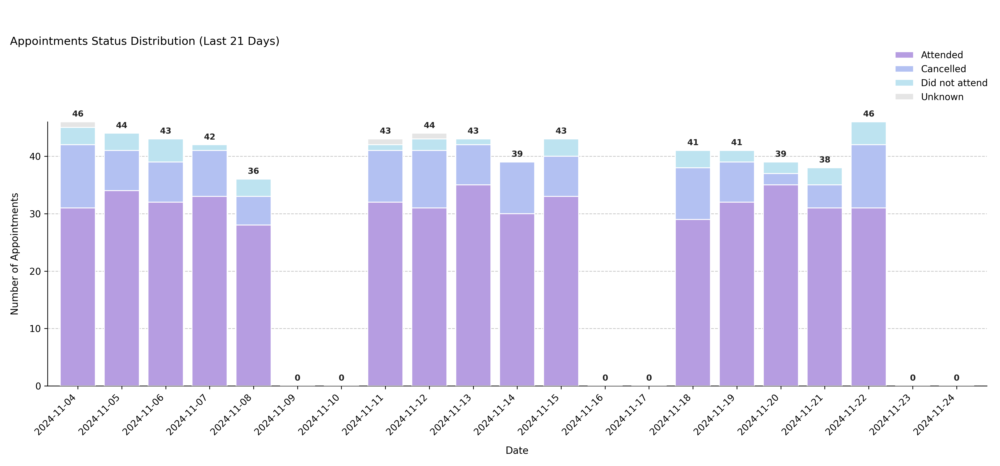

4. **Upcoming daily bookings (next 21 days)** – Near-term expected activity.  
   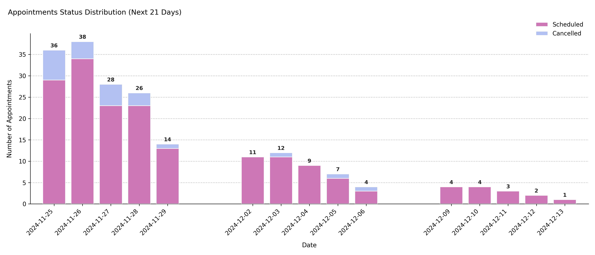

**Interpretation:**  
Attendance follows a balanced pattern: most patients attend, a smaller share cancel, and few miss appointments. About half of the cancelled visits are rebooked, keeping utilization stable over time.

---

## Example 2 – No-rebooking system (low adaptability)
A rigid scheduling model where cancelled appointments are never rebooked.  
This setup mimics systems with poor patient follow-up or limited administrative capacity.

```python
sched_norebook = AppointmentScheduler(
    date_ranges=[("2024-01-01", "2024-12-31")],
    ref_date="2024-11-25",
    fill_rate=0.85,
    status_rates={"attended":0.75,"cancelled":0.15,"did not attend":0.09,"unknown":0.01},
    rebook_category="min"
)

slots_df, appts_df, patients_df = sched_norebook.generate()

plot_appointments_by_status(appts_df, scheduler=sched_norebook)
plot_appointments_by_status_future(appts_df, scheduler=sched_norebook)
plot_status_distribution_last_days(appts_df, scheduler=sched_norebook, days_back=21)
plot_status_distribution_next_days(appts_df, scheduler=sched_norebook, days_ahead=21)
```

**Output preview:**  
Below are the four main outputs for this configuration:

1. **Past appointment outcomes** – Shows lower overall completion rates due to unrebooked cancellations.  
   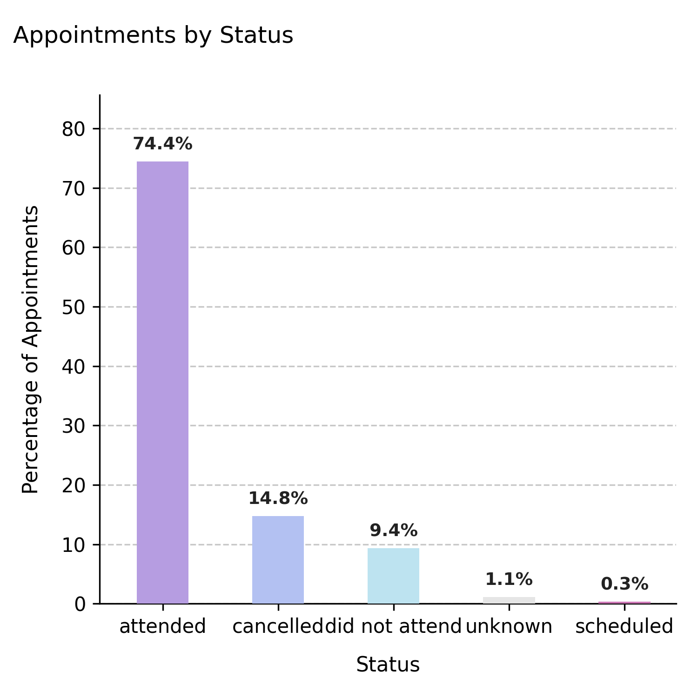

2. **Future appointment outcomes** – Demonstrates reduced forward occupancy and more open capacity.  
   

3. **Recent daily activity (past 21 days)** – Displays visible dips following cancellation spikes.  
   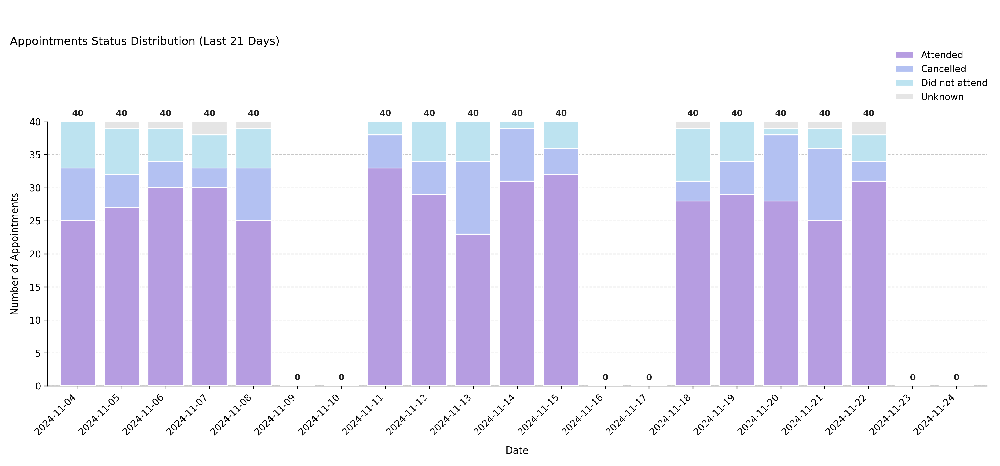

4. **Upcoming daily bookings (next 21 days)** – Shows empty days ahead due to missing reschedules.  
   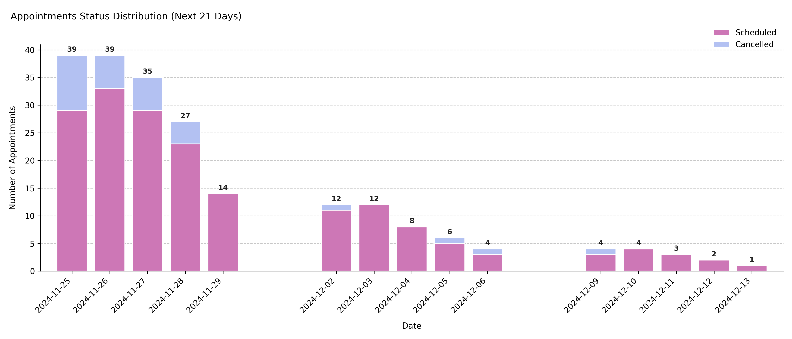

**Interpretation:**  
With no rebooking, cancellations directly reduce throughput.  
Future occupancy remains lower, making this configuration representative of clinics that cannot replace missed visits quickly.

---

## Example 3 – Fully adaptive scheduling (maximum rebooking)
A highly responsive service where all cancelled appointments are immediately rebooked, and non-attendance rates are minimal.

```python
sched_rebookmax = AppointmentScheduler(
    date_ranges=[("2024-01-01", "2024-12-31")],
    ref_date="2024-11-25",
    fill_rate=0.9,
    status_rates={"attended":0.85,"cancelled":0.10,"did not attend":0.04,"unknown":0.01},
    rebook_category="max"
)

slots_df, appts_df, patients_df = sched_rebookmax.generate()

plot_appointments_by_status(appts_df, scheduler=sched_rebookmax)
plot_appointments_by_status_future(appts_df, scheduler=sched_rebookmax)
plot_status_distribution_last_days(appts_df, scheduler=sched_rebookmax, days_back=21)
plot_status_distribution_next_days(appts_df, scheduler=sched_rebookmax, days_ahead=21)
```

**Output preview:**  
Below are the four main outputs for this configuration:

1. **Past appointment outcomes** – Almost all historical slots are attended or rebooked.  
   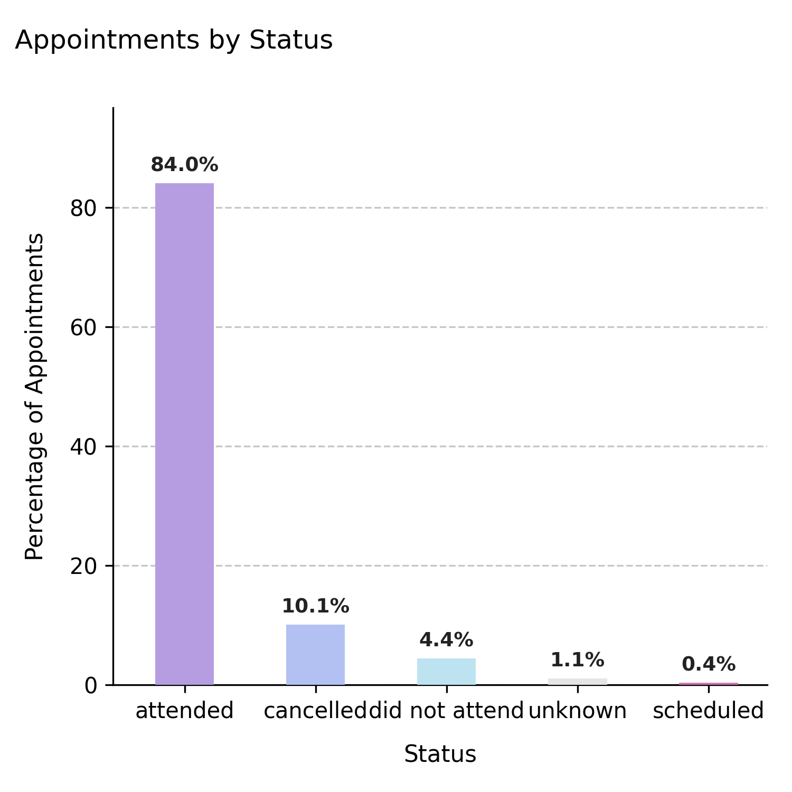

2. **Future appointment outcomes** – Shows a nearly filled forward calendar with minimal cancellations.  
   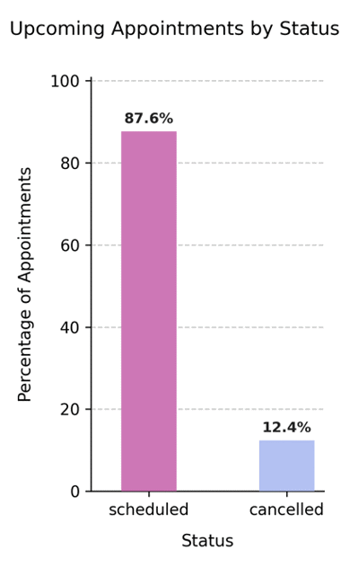

3. **Recent daily activity (past 21 days)** – Displays consistently high attendance and rapid recovery from cancellations.  
   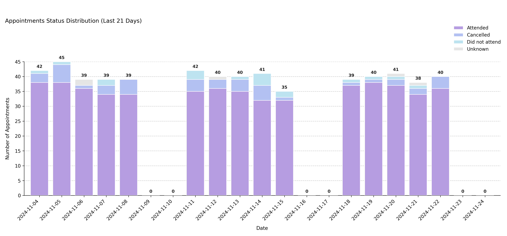

4. **Upcoming daily bookings (next 21 days)** – Maintains high occupancy across future days.  
   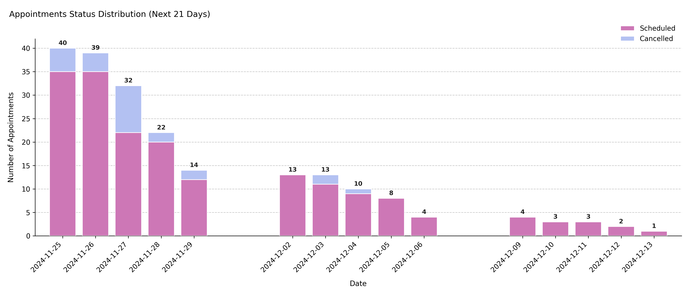

**Interpretation:**  
This system maximizes capacity by instantly recycling cancellations into new bookings. Attendance remains strong, future utilization near complete, and daily activity stable — typical of high-efficiency environments.

---

## Summary
| Scenario | `rebook_category` | Attendance pattern | Utilization outcome |
|-----------|------------------|--------------------|--------------------|
| **Balanced** | `"med"` | Typical mix of attended/cancelled/DNA | Stable utilization |
| **No rebooking** | `"min"` | Lower throughput, cancellations lost | Declining occupancy |
| **Full rebooking** | `"max"` | Almost all cancellations recovered | Near-max efficiency |

---

### Next Steps
- Examine how attendance influences patient flow in {doc}`../api-reference/patient_flow`.  
- Explore {doc}`../api-reference/appointments_table` for how outcomes are stored.  
- See {doc}`../api-reference/booking_dynamics` for how fill rate and scheduling affect these behaviors.

