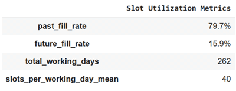
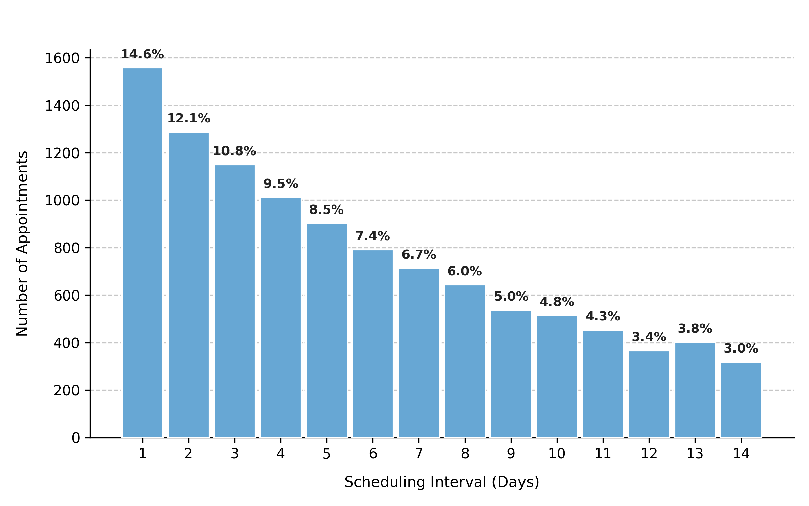
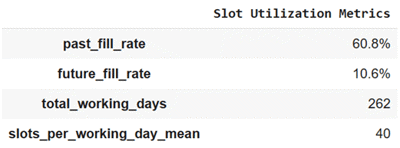

# Booking Dynamics and Utilization Patterns

## Overview
Appointment systems balance three core temporal dynamics:
- **`fill_rate`** – how much capacity is used.
- **`booking_horizon`** – how far into the future appointments can be made.
- **`median_lead_time`** – how early patients tend to book relative to their visit.

These parameters jointly define the rhythm of the appointment calendar — from near-term saturation to long-range planning. This notebook illustrates three realistic scenarios, each highlighting different booking behaviors and utilization levels.

---

## Example 1 – Community clinic with moderate utilization (balanced system)
A mid-sized primary care clinic with stable operations throughout the year.  
Bookings are accepted up to 30 days in advance, and patients typically reserve about 10 days before their visit. Utilization is high but not saturated, representing a well-functioning outpatient system.

```python
from medscheduler import AppointmentScheduler
from medscheduler.utils.plotting import (
    plot_past_slot_availability, plot_future_slot_availability,
    plot_scheduling_interval_distribution, summarize_slots
)
import pandas as pd

sched_balanced = AppointmentScheduler(
    date_ranges=[("2024-01-01", "2024-12-31")],
    ref_date="2024-11-25",  # reference near end of year
    fill_rate=0.8,           # moderate utilization
    booking_horizon=30,      # 30-day booking window
    median_lead_time=10      # typical patient scheduling pattern
)

slots_df, appts_df, patients_df = sched_balanced.generate()

# Visualizations
plot_past_slot_availability(slots_df, scheduler=sched_balanced)
plot_future_slot_availability(slots_df, scheduler=sched_balanced, freq="D")
plot_scheduling_interval_distribution(appts_df)

# Summarize slot utilization
summary = summarize_slots(slots_df, scheduler=sched_balanced)
metrics = {}
for k in ["past_fill_rate", "future_fill_rate", "total_working_days", "slots_per_working_day_mean"]:
    val = summary[k]
    if "fill_rate" in k:
        metrics[k] = f"{val * 100:.1f}%" 
    else:
        metrics[k] = int(round(val)) 
pd.Series(metrics, name="Slot Utilization Metrics")
```

**Output preview:**  
Below are the four main outputs for this configuration:

1. **Past slot utilization** – Shows stable historical utilization, with most past slots booked.  
   

2. **Future slot projection** – Displays upcoming availability tapering beyond the 30-day booking window.  
   

3. **Scheduling interval distribution** – Indicates that most patients book about 10 days before their appointment.  
   

4. **Calendar summary metrics** – Key utilization indicators derived from `summarize_slots`.  
   

**Interpretation:**  
The clinic exhibits steady demand and balanced utilization: roughly 80% of slots filled, with near-term slots booked first and gradually decaying toward the end of the 30-day window. Lead times cluster around 10 days, representing a healthy and accessible booking rhythm.

---

## Example 2 – High-demand outpatient service (near-capacity system)
A hospital specialty unit where most appointment slots are booked quickly. Patients can reserve up to two weeks ahead, producing high short-term saturation and minimal unbooked capacity.

```python
sched_highdemand = AppointmentScheduler(
    date_ranges=[("2024-01-01", "2024-12-31")],
    ref_date="2024-11-25",
    fill_rate=0.95,          # near full utilization
    booking_horizon=14,      # short booking window
    median_lead_time=7       # median scheduling one week in advance
)

slots_df, appts_df, patients_df = sched_highdemand.generate()

plot_past_slot_availability(slots_df, scheduler=sched_highdemand)
plot_future_slot_availability(slots_df, scheduler=sched_highdemand, freq="D")
plot_scheduling_interval_distribution(appts_df)

summary = summarize_slots(slots_df, scheduler=sched_balanced)
metrics = {}
for k in ["past_fill_rate", "future_fill_rate", "total_working_days", "slots_per_working_day_mean"]:
    val = summary[k]
    if "fill_rate" in k:
        metrics[k] = f"{val * 100:.1f}%" 
    else:
        metrics[k] = int(round(val)) 

pd.Series(metrics, name="Slot Utilization Metrics")
```

**Output preview:**  
Below are the four main outputs for this configuration:

1. **Past slot utilization** – Reflects almost complete occupancy in the historical calendar.  
   

2. **Future slot projection** – Illustrates a dense schedule over the short 14-day horizon.  
   

3. **Scheduling interval distribution** – Highlights that most bookings occur within the week before appointments.  
   

4. **Calendar summary metrics** – Displays utilization levels approaching 95% across the board.  
   

**Interpretation:**  
The near-saturated calendar produces minimal idle capacity, with both historical and upcoming slots showing over 90% occupancy. Most bookings occur within the week prior to the appointment, generating a dense, short-horizon schedule typical of busy outpatient departments.

---

## Example 3 – Preventive care center (long-term planning, lower utilization)
A preventive medicine or wellness clinic that schedules check-ups and screenings far in advance. Utilization is moderate, but the booking horizon is long, spreading appointments evenly over time.

```python
sched_preventive = AppointmentScheduler(
    date_ranges=[("2024-01-01", "2024-12-31")],
    ref_date="2024-11-25",
    fill_rate=0.6,           # lower overall utilization
    booking_horizon=60,      # two-month forward window
    median_lead_time=20      # proactive scheduling
)

slots_df, appts_df, patients_df = sched_preventive.generate()

plot_past_slot_availability(slots_df, scheduler=sched_preventive)
plot_future_slot_availability(slots_df, scheduler=sched_preventive)
plot_scheduling_interval_distribution(appts_df)

summary = summarize_slots(slots_df, scheduler=sched_preventive)
metrics = {}
for k in ["past_fill_rate", "future_fill_rate", "total_working_days", "slots_per_working_day_mean"]:
    val = summary[k]
    if "fill_rate" in k:
        metrics[k] = f"{val * 100:.1f}%" 
    else:
        metrics[k] = int(round(val)) 
pd.Series(metrics, name="Slot Utilization Metrics")
```

**Output preview:**  
Below are the four main outputs for this configuration:

1. **Past slot utilization** – Displays moderate historical utilization with stable weekly capacity.  
   

2. **Future slot projection** – Illustrates extended forward availability beyond the two-month horizon.  
   

3. **Scheduling interval distribution** – Shows that most bookings occur roughly 20 days before the appointment.  
   

4. **Calendar summary metrics** – Indicates a 60% utilization rate and evenly distributed scheduling.  
   

**Interpretation:**  
This configuration produces a flatter utilization pattern, where upcoming slots extend far into the future but are only partially filled. The wide booking horizon ensures accessibility, while the lower fill rate keeps daily load manageable — characteristic of preventive or low-urgency services.

---

## Summary
| Scenario | Fill rate | Booking horizon | Median lead time | Booking behavior |
|-----------|------------|----------------|------------------|------------------|
| **Community clinic** | 0.8 | 30 days | 10 days | Balanced and steady scheduling |
| **High-demand service** | 0.95 | 14 days | 7 days | Short-term saturation, high occupancy |
| **Preventive care** | 0.6 | 60 days | 20 days | Long-range, planned reservations |

---

## Notes
- Higher **fill rates** increase past and future utilization but may limit access.
- Shorter **booking horizons** compress demand into near-term slots.
- Longer **lead times** produce smoother, forward-distributed booking patterns.

---

### Next Steps
- Learn how booking behavior interacts with attendance in {doc}`../api-reference/attendance_behavior`  
- Explore how slot timing affects punctuality in {doc}`../api-reference/appointment_timing`  
- Revisit {doc}`../api-reference/seasonality_weights` to see how temporal weights further influence booking density.

