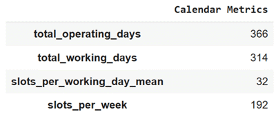

# Calendar Structure and Daily Capacity

## Overview
The **calendar structure** defines how the simulated clinic allocates time and capacity across the week.  
Parameters like **`working_days`**, **`working_hours`**, **`appointments_per_hour`**, and **`weekday_weights`** determine when slots are generated, how dense the schedule is, and how demand fluctuates through the week.

This notebook illustrates three contrasting scheduling models:
1. A weekday clinic with Saturday operation
2. A short-week split-shift service
3. An urgent care center open seven days with weekday demand bias

Each scenario includes:
- Realistic configuration code
- Visualizations of appointment distribution, recent activity, and capacity metrics
- A summary table from `summarize_slots`

---

## Example 1 – Weekday clinic with Saturday operation
A general outpatient service open Monday–Saturday, with continuous daily hours (9 AM – 5 PM) and standard 15-minute slots.  
This layout represents a moderately extended working week without major shift changes.

```python
from medscheduler import AppointmentScheduler
from medscheduler.utils.plotting import (
    plot_weekday_appointment_distribution,
    plot_status_distribution_last_days,
    summarize_slots
)
import pandas as pd

sched_specialty = AppointmentScheduler(
    date_ranges=[("2024-01-01", "2024-12-31")],
    ref_date="2024-11-25",                                          
    working_days=[0, 1, 2, 3, 4, 5],  # Monday–Saturday
    working_hours=[(9, 17)],           # 9 AM – 5 PM continuous
    appointments_per_hour=4            # Default 15-minute slots
)

slots_df, appts_df, patients_df = sched_specialty.generate()

# Visualize weekly appointment distribution and recent outcomes
plot_weekday_appointment_distribution(appts_df)
plot_status_distribution_last_days(appts_df, scheduler=sched_specialty, days_back=21)

# Summarize key metrics
summary = summarize_slots(slots_df, scheduler=sched_specialty)
metrics = {k: summary[k] for k in [
    "total_operating_days", "total_working_days", "slots_per_working_day_mean", "slots_per_week"
]}
pd.Series(metrics, name="Calendar Metrics").astype(int)
```

**Output preview:**  
Below are the three main outputs for this configuration:

1. **Weekly appointment distribution** – The share of appointments across weekdays.  
   

2. **Recent appointment activity (last 21 days)** – Number of attended, cancelled, and missed appointments per day.  
   

3. **Calendar summary metrics** – Key calendar statistics from `summarize_slots`.  
   

**Interpretation:**  
This configuration provides consistent weekday activity with an additional Saturday session, raising the total number of working days and weekly slots.  
Typical yearly operation includes roughly 310 working days, 40 slots per day, and about 240–250 total weekly appointments.

---

## Example 2 – Short-week split-shift service
A focused service operating Tuesday–Friday, organized into morning and afternoon blocks.  
Appointments last 20 minutes each (3 per hour), representing specialized sessions or reduced patient flow.

```python
sched_split_shift = AppointmentScheduler(
    date_ranges=[("2024-01-01", "2024-12-31")],
    ref_date="2024-11-25",
    working_days=[1, 2, 3, 4],         # Tuesday–Friday
    working_hours=[(8, 12), (13, 17)], # Split shifts
    appointments_per_hour=3            # 20-minute slots
)

slots_df, appts_df, patients_df = sched_split_shift.generate()

# Visualize weekday distribution and recent appointment activity
plot_weekday_appointment_distribution(appts_df)
plot_status_distribution_last_days(appts_df, scheduler=sched_split_shift, days_back=21)

# Summarize slot capacity metrics
summary = summarize_slots(slots_df, scheduler=sched_split_shift)
metrics = {k: summary[k] for k in [
    "total_operating_days", "total_working_days", "slots_per_working_day_mean", "slots_per_week"
]}
pd.Series(metrics, name="Calendar Metrics").astype(int)
```

**Output preview:**  
1. **Weekday appointment distribution** – The four active weekdays each contribute evenly to total workload.  
   

2. **Recent appointment activity (last 21 days)** – Shows daily workload for each appointment status category.  
   

3. **Calendar summary metrics** – Displays key totals and daily means for this configuration.  
   

**Interpretation:**  
Restricting the clinic to four days per week lowers total capacity but maintains a stable daily workload.  
The mid-day break slightly reduces daily slots, yet allows flexibility in staffing and facility use.  
Such structures are typical in specialized units or research clinics operating part-time.

---

## Example 3 – Urgent care center with daily operation and weekday weighting
A 7-day urgent care clinic open from 8 AM – 6 PM.  
Custom `weekday_weights` create heavier weekday traffic, while a lower `fill_rate` amplifies the visible differences in utilization.

```python
sched_urgentcare = AppointmentScheduler(
    date_ranges=[("2024-01-01", "2024-12-31")],
    ref_date="2024-11-25",                                     
    working_days=[0, 1, 2, 3, 4, 5, 6],  # Every day
    working_hours=[(8, 18)],
    fill_rate=0.75,                      # Highlight weekday bias
    weekday_weights={0:1.5, 1:1.3, 2:1.2, 3:1.0, 4:0.9, 5:0.7, 6:0.4}
)

slots_df, appts_df, patients_df = sched_urgentcare.generate()

# Visualize relative weekday load and recent outcomes
plot_weekday_appointment_distribution(appts_df)
plot_status_distribution_last_days(appts_df, scheduler=sched_urgentcare, days_back=21)

# Summarize slot capacity metrics
summary = summarize_slots(slots_df, scheduler=sched_urgentcare)
metrics = {k: summary[k] for k in [
    "total_operating_days", "total_working_days", "slots_per_working_day_mean", "slots_per_week"
]}
pd.Series(metrics, name="Calendar Metrics").astype(int)
```

**Output preview:**  
1. **Weekday distribution with custom weights** – Monday–Wednesday dominate total activity due to higher weekday weights.  
   

2. **Recent appointment outcomes (last 21 days)** – Displays how weekday load fluctuates with demand intensity.  
   

3. **Calendar summary metrics** – Reflects 7-day operation and increased overall slot count.  
   

**Interpretation:**  
When weekday weights and a reduced `fill_rate` interact, weekday imbalances become evident.  
The clinic maintains constant open hours, but Monday–Wednesday show denser activity, tapering into the weekend.  
The summary table confirms higher weekday capacity and reduced weekend load, resembling real-world urgent care demand.


---

## Next Steps
- Learn how weekday and month weights interact in {doc}`../api-reference/seasonality_weights`  
- Review probabilistic booking logic in {doc}`../api-reference/booking_dynamics`  
- Explore how these structures connect to {doc}`../api-reference/date_ranges_ref_date`  
- For temporal and demographic extensions, see {doc}`../api-reference/patient_flow`

