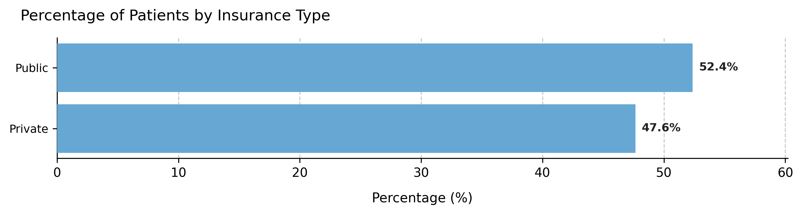
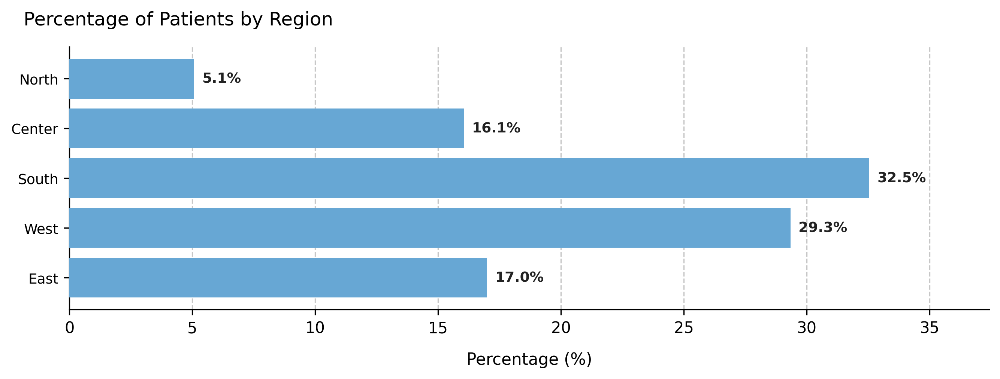
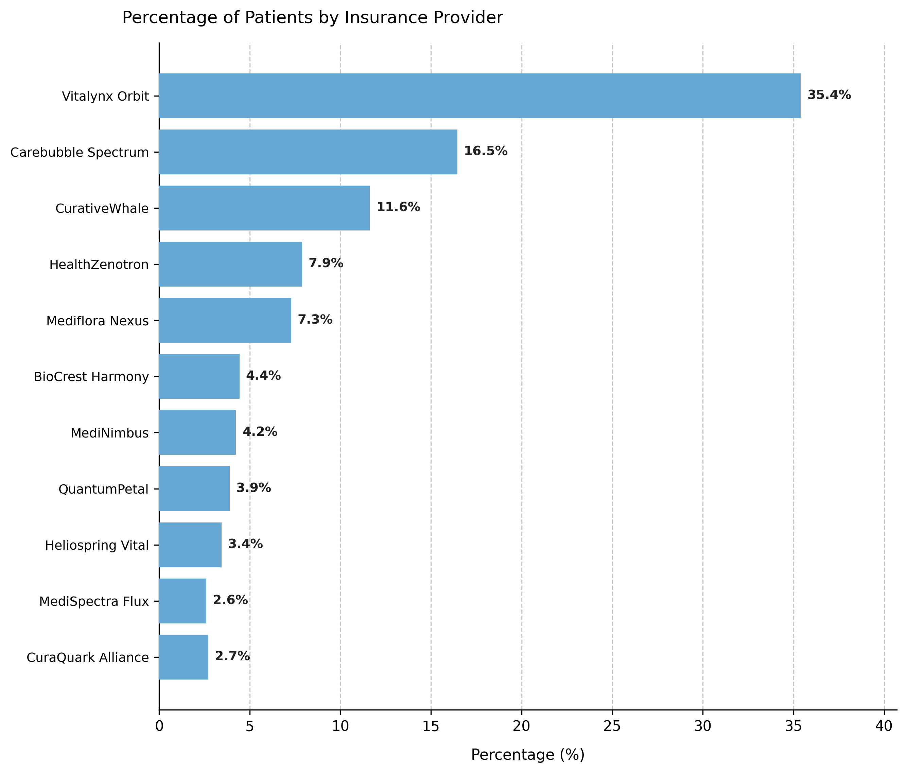

# Adding Custom Categorical Variables

## Overview  
Beyond demographic and scheduling parameters, **`AppointmentScheduler`** allows extending the synthetic dataset with new **categorical variables** — such as insurance type, geographic region, or clinic branch — using the `add_custom_column()` method.  
These additional fields enrich the simulated patient table (`patients_df`) without altering the core data-generation process.

You will explore:  
1. Adding a balanced attribute (uniform distribution).  
2. Adding a skewed regional attribute (normal distribution).  
3. Adding a highly imbalanced attribute (Pareto distribution).

---

## Example 1 – Uniform distribution (balanced attribute)  
A new variable `insurance_type` evenly splits the population into *Public* and *Private* coverage.

```python
from medscheduler import AppointmentScheduler
from medscheduler.utils.plotting import plot_custom_column_distribution

# Generate baseline dataset
sched_uniform = AppointmentScheduler()
slots_df, appts_df, patients_df = sched_uniform.generate()

# Add insurance type with uniform probability
sched_uniform.add_custom_column(
    column_name="insurance_type",
    categories=["Public", "Private"],
    distribution_type="uniform"
)

plot_custom_column_distribution(patients_df, column="insurance_type")
```

**Output preview:**  
Below are the main results for this configuration:

1. **Category distribution** – Nearly equal proportions across insurance groups.  
   

**Interpretation:**  
Uniform distributions are ideal for balanced segmentation variables, ensuring each group is equally represented — useful for fair testing or visualization purposes.

---

## Example 2 – Normal distribution (regional variation)  
Now we introduce a three-region attribute, with the central region most frequent and the outer ones less represented.

```python
sched_region = AppointmentScheduler()
slots_df, appts_df, patients_df = sched_region.generate()

sched_region.add_custom_column(
    column_name="region",
    categories=["North", "Center", "South", "West", "East"],
    distribution_type="normal"
)

plot_custom_column_distribution(patients_df, column="region")
```

**Output preview:**  

1. **Category distribution** – Bell-shaped distribution with a dominant “Center” group.  
   

**Interpretation:**  
The *normal* model generates a realistic middle-heavy pattern, useful for representing geographically centered populations or other naturally clustered attributes.

---

## Example 3 – Pareto distribution (dominant providers)  
Finally, we simulate a field representing health insurance providers, where a few dominate the market while others serve smaller shares.

```python
sched_pareto = AppointmentScheduler()
slots_df, appts_df, patients_df = sched_pareto.generate()

sched_pareto.add_custom_column(
    column_name="insurance_provider",
    categories=[
        "Vitalynx Orbit", "Carebubble Spectrum", "CurativeWhale",
        "HealthZenotron", "Mediflora Nexus", "BioCrest Harmony",
        "MediNimbus", "QuantumPetal", "Heliospring Vital",
        "MediSpectra Flux", "CuraQuark Alliance"
    ],
    distribution_type="pareto"
)

plot_custom_column_distribution(patients_df, column="insurance_provider")
```

**Output preview:**  

1. **Category distribution** – Heavily right-skewed proportions showing a few dominant insurers.  
   

**Interpretation:**  
The *Pareto* model mirrors real-world skewness, where a small number of categories account for most observations.  
Such variables are useful when simulating unequal resource distribution or modeling provider market share.

---

## Summary  
| Scenario | Distribution type | Typical shape | Use case |
|-----------|-------------------|----------------|-----------|
| **Insurance type** | Uniform | Flat | Balanced segmentation |
| **Region** | Normal | Bell-shaped | Central dominance |
| **Insurance provider** | Pareto | Right-skewed | Market inequality |

---

### Notes  
- Each column is reproducible under the same `seed`.  
- Probabilities can also be manually supplied via `custom_probs`.  
- Added fields integrate seamlessly into `patients_df` for analysis, joining, or visualization.  

---

### Next Steps  
- Review {doc}`../api-reference/patients_table` to see how these columns integrate into patient data.  
- Explore {doc}`../api-reference/randomness_and_noise` for details on stochastic sampling.  
- Combine with demographic or flow parameters to create richer simulation scenarios.  
- Return to {doc}`patient_flow_demographics` to visualize how added attributes interact with baseline population structure.


