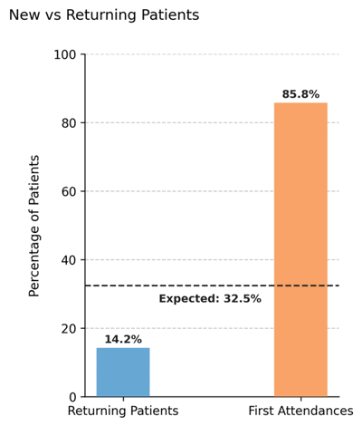
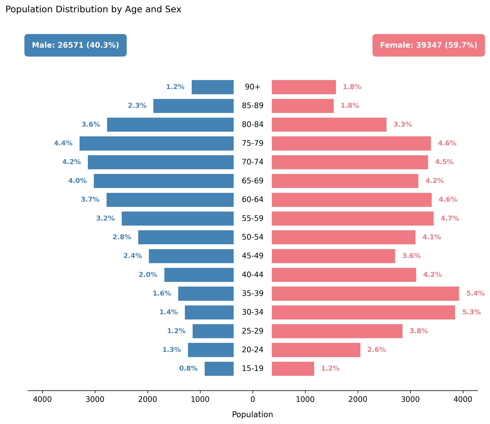

# Patient Flow and Demographic Structure

## Overview  
The parameters **`visits_per_year`**, **`first_attendance`**, and **`age_gender_probs`** jointly define how patients interact with the healthcare system and how their demographic composition is modeled.  
They determine who the patients are, how often they return, and the balance between new and follow-up appointments.  

This notebook illustrates how visit frequency, attendance type, and demographic patterns combine to produce a realistic synthetic population.

You will explore:
1. Typical population structure and attendance flow.  
2. The relationship between simulation time span and observed first attendances.  
3. How visit frequency and patient age distribution shape appointment volumes.

---

## Example 1 – Typical outpatient population (default behavior)
A 10-year simulation period ensures stable age and attendance distributions.  
This configuration uses default NHS-derived demographic proportions and first attendance ratio (`0.325`).

```python
from medscheduler import AppointmentScheduler
from medscheduler.utils.plotting import (
    plot_population_pyramid,
    plot_patients_visits,
    plot_first_attendance_distribution
)

sched_default = AppointmentScheduler(
    date_ranges=[("2015-01-01", "2024-12-31")],
    ref_date="2024-11-25",
    seed=0
)

slots_df, appts_df, patients_df = sched_default.generate()

# Visualizations
plot_population_pyramid(appts_df)
plot_patients_visits(appts_df, years_back=1)
plot_first_attendance_distribution(appts_df, scheduler=sched_default)
```

**Output preview:**  
Below are the main visualizations for this configuration:

1. **Population pyramid** – Age and sex distribution reflecting NHS outpatient proportions.  
   

2. **Visits per patient (past year)** – Number of appointments per unique patient within the most recent year.  
   

3. **First attendance distribution** – Observed proportion of new vs. follow-up appointments.  
   

**Interpretation:**  
The synthetic cohort mirrors adult outpatient demographics, with higher female representation and a median age in the late 40s–50s.  
Over a 10-year period, the proportion of **first attendances** (~33%) aligns closely with the configured `first_attendance` parameter, since the long window allows returning patients to accumulate multiple follow-ups.

---

## Example 2 – Short simulation window (inflated first attendances)
A short observation window produces an artificially high proportion of *first attendances*, since fewer patients have time to return for follow-up visits.

```python
sched_short = AppointmentScheduler(
    date_ranges=[("2024-01-01", "2024-12-31")],
    ref_date="2024-11-25",
    seed=0
)

slots_df, appts_df, patients_df = sched_short.generate()

plot_first_attendance_distribution(appts_df, scheduler=sched_short)
```

**Output preview:**  

1. **First attendance distribution (1-year window)** – Shows an inflated rate of new patients due to limited follow-up opportunities.  
   

**Interpretation:**  
When the simulation covers only few years, most appointments are from patients seen for the first time.  
Because follow-ups require prior encounters, short time frames underrepresent returning visits.  
This explains why the observed first-attendance proportion may **exceed** the configured value when the time range is narrow.  
Conversely, extending the time range beyond 10 years can **reduce** the proportion below the target, since patients accumulate multiple follow-ups over time.

---

## Example 3 – High-frequency chronic care system
In contrast, this configuration models a chronic-care clinic with frequent revisits (`visits_per_year=3.0`) and fewer new patients (`first_attendance=0.1`).

```python
sched_chronic = AppointmentScheduler(
    date_ranges=[("2019-01-01", "2024-12-31")],
    ref_date="2024-11-25",
    visits_per_year=3.0,
    first_attendance=0.1,
    seed=0
)

slots_df, appts_df, patients_df = sched_chronic.generate()

plot_population_pyramid(appts_df)
plot_patients_visits(appts_df, years_back=1)
plot_first_attendance_distribution(appts_df, scheduler=sched_chronic)
```

**Output preview:**  
Below are the key results for this chronic-care configuration:

1. **Population pyramid** – Similar demographic base but slightly older patient concentration.  
   

2. **Visits per patient (past year)** – Distribution shifted upward, with more frequent revisits per person.  
   

3. **First attendance distribution** – Majority of appointments from returning patients (~90%).  
   

**Interpretation:**  
This setup reflects specialty clinics managing chronic diseases or ongoing therapies.  
The average patient appears several times per year, resulting in dense longitudinal engagement.  
Because of this, the *first attendance* proportion is low and stable over time.

> **Note on interpreting `plot_patients_visits`:**  
> The function computes visit frequency for a **one-year window** (`years_back=1`).  
> When using wider windows (e.g., `years_back=2`), the mean visits per year no longer represents the `visits_per_year` parameter, since it averages across different temporal lengths.  
> For valid interpretation, analyses of visit frequency should therefore use a 1-year range.

---

## Summary  
| Scenario | Time span | `visits_per_year` | `first_attendance` | Observed effect |
|-----------|------------|-------------------|--------------------|------------------|
| **Typical outpatient** | 10 years | 1.2 | 0.325 | Balanced new vs. follow-up patients |
| **Short-term simulation** | 1 year | 1.2 | 0.325 | Overestimated first attendances |
| **Chronic care system** | 10 years | 3.0 | 0.1 | Frequent repeat visits, few new patients |

---

### Notes  
- Shorter simulation ranges inflate *first attendance* rates, while longer ones dilute them.  
- `visits_per_year` controls revisit frequency, but its meaning remains accurate only when analyzed per one-year period.  
- Age and gender probabilities are normalized to reproduce realistic outpatient population structures.

---

### Next Steps  
- Review {doc}`../api-reference/patients_table` to explore patient-level attributes.  
- Explore {doc}`../api-reference/appointment_timing` to analyze how visit timing interacts with demographics.  
- See {doc}`../api-reference/attendance_behavior` for how attendance outcomes complement patient flow dynamics.

