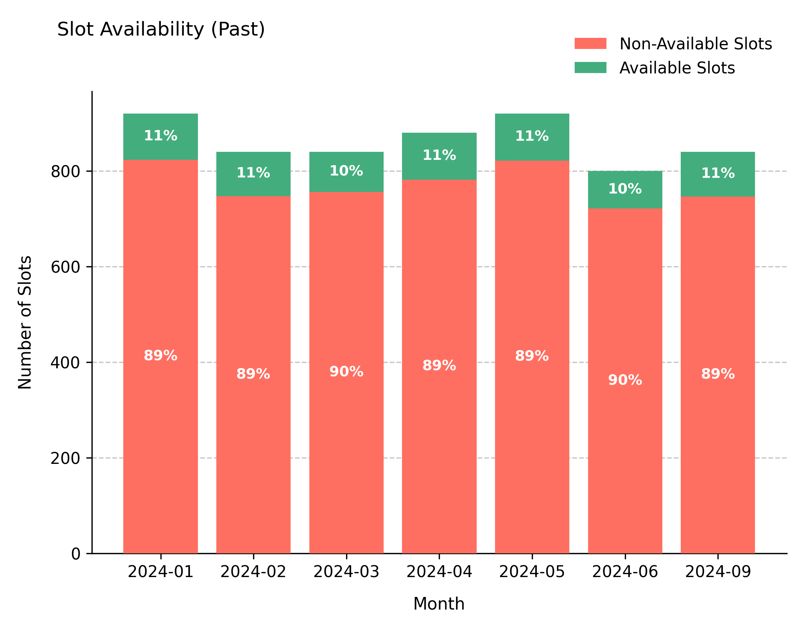
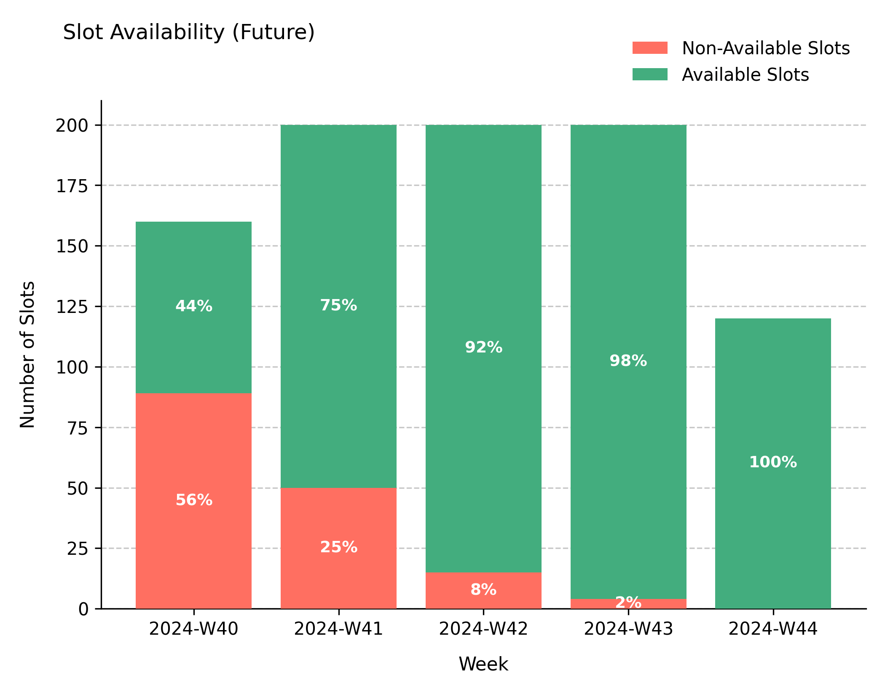
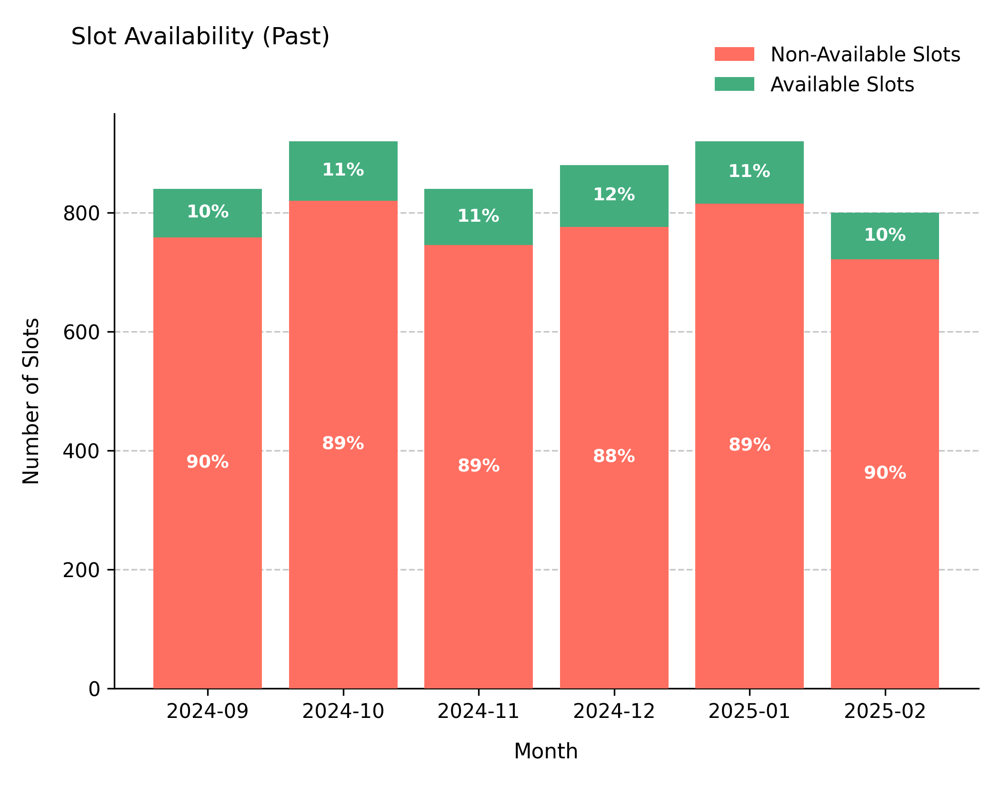
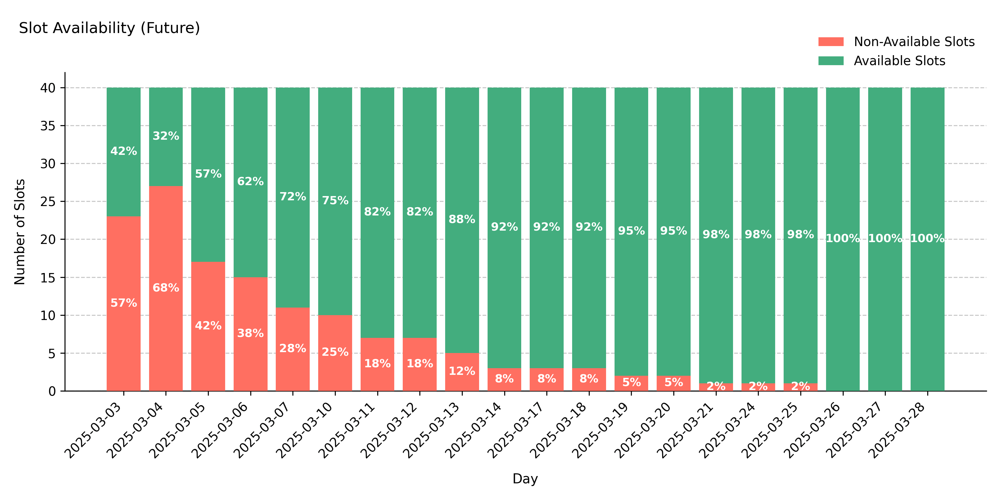
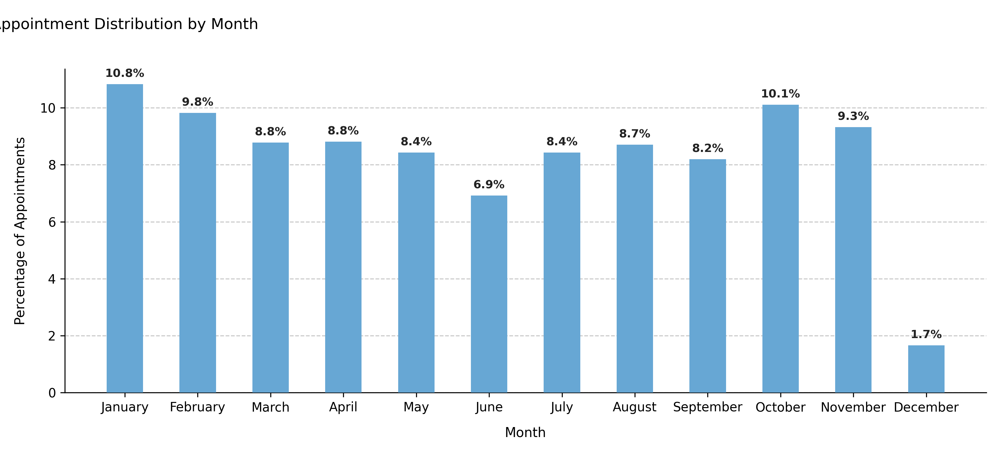

# Simulation Windows and Seasonal Activity

## Overview
Healthcare organizations rarely operate uniformly throughout the year.  
Clinics may pause during holidays, hospitals may run at reduced capacity in summer, and research units often follow academic calendars.  

This notebook demonstrates how **`date_ranges`**, **`ref_date`**, and **seasonal weighting parameters** (`month_weights`, `weekday_weights`) can be combined to model realistic time structures for different healthcare services.

You will explore:
1. A year-round clinic with split operational periods  
2. An academic hospital with mid-year reference date  
3. A winter-focused specialty clinic with monthly seasonal bias  

Each scenario shows how temporal parameters affect the available slots and appointment patterns.

---

## Example 1 – Split operational periods (e.g., summer closure)
A pediatric clinic that operates January–June and September–December, closing for mid-year maintenance.

```python
from medscheduler import AppointmentScheduler
from medscheduler.utils.plotting import plot_past_slot_availability, plot_future_slot_availability

# Two operational blocks within the same year
sched_split = AppointmentScheduler(
    date_ranges=[
        ("2024-01-01", "2024-06-30"),
        ("2024-09-01", "2024-12-31"),
    ],
    ref_date="2024-10-01"
)

slots_df, appts_df, patients_df = sched_split.generate()

# Visualize utilization before and after the reference date
plot_past_slot_availability(slots_df, scheduler=sched_split)
plot_future_slot_availability(slots_df, scheduler=sched_split)
```


**Output preview:**  
Below are the resulting charts for slot utilization before and after the reference date.





**Interpretation:**  
The resulting calendar shows two distinct booking periods separated by a service pause, allowing analysis of how seasonal breaks affect appointment availability.

---

## Example 2 – Academic hospital with mid-year reference date
A teaching hospital running from September 2024 to August 2025, with `ref_date` set mid-cycle to simulate data extraction at semester’s end.

```python
from medscheduler import AppointmentScheduler
from medscheduler.utils.plotting import plot_past_slot_availability, plot_future_slot_availability

sched_academic = AppointmentScheduler(
    date_ranges=[("2024-09-01", "2025-08-31")],
    ref_date="2025-03-01"
)

slots_df, appts_df, patients_df = sched_academic.generate()

# Monthly aggregation for easier interpretation
plot_past_slot_availability(slots_df, scheduler=sched_academic)
plot_future_slot_availability(slots_df, scheduler=sched_academic, freq="D")
```

**Output preview:**  
The following figures illustrate appointment capacity before and after the reference date (`2025-03-01`).






**Interpretation:**  
The `ref_date` defines the cut-off between completed and upcoming appointments.  
This configuration is useful for longitudinal reporting in academic or research settings.

---

## Example 3 – Seasonal adjustment with monthly weights
A general outpatient service that remains open year-round but shows strong seasonal variation, with reduced demand in summer and peaks during winter.

```python
from medscheduler import AppointmentScheduler
from medscheduler.utils.plotting import plot_monthly_appointment_distribution

# Year-round calendar with explicit seasonal weights
sched_seasonal = AppointmentScheduler(
    date_ranges=[("2024-01-01", "2024-12-31")],
    ref_date="2024-12-01",
    fill_rate=0.7,  # lower fill rate amplifies the visible effect of seasonal weights
    month_weights={
        1:1.4,  2:1.3,  3:1.1,   # winter–early spring: high demand
        4:0.9,  5:0.8,  6:0.7,   # summer dip
        7:0.8,  8:0.9,  9:1.0,   # gradual recovery
        10:1.2, 11:1.3, 12:1.4   # late autumn–winter peak
    }
)

slots_df, appts_df, patients_df = sched_seasonal.generate()

# Visualize the seasonal pattern of appointment volumes
plot_monthly_appointment_distribution(appts_df)
```

*Output preview:**  
The next chart shows the visible seasonal pattern in appointment volumes across months.



**Interpretation:**  
The simulation produces visible peaks in winter months and fewer appointments during summer, closely resembling the demand curve of respiratory or flu clinics.  
Note that **seasonal weights have greater visual impact when `fill_rate` is below 1**, because more variability remains available for probabilistic differences between months.  

In this example, December shows a smaller share of total appointments even though its weight is high — this occurs because the `ref_date` (`2024-12-01`) marks the start of the *future period*, so the chart reflects only appointments *scheduled after that date*. This behavior adds realism by mimicking mid-month data extraction where upcoming slots are still filling up.

Additionally, the apparent monthly proportions depend not only on the defined `month_weights` but also on:
- the **number of calendar days per month**,  
- how many of those days fall on **working days** (`working_days`), and  
- the **weekday weights** applied internally.  

As a result, months with more weekdays or with heavier weekday weighting (e.g. more Mondays) may appear slightly over-represented relative to their raw month weight.

---

## Next Steps
- Explore parameter definitions in {doc}`../api-reference/date_ranges_ref_date`  
- Learn how seasonality modifies utilization: {doc}`../api-reference/seasonality_weights`  
- Understand how booking and fill rate interact with time ranges: {doc}`../api-reference/booking_dynamics`  
- Visualize calendar structures in detail: {doc}`../visualization/plot_past_slot_availability`

