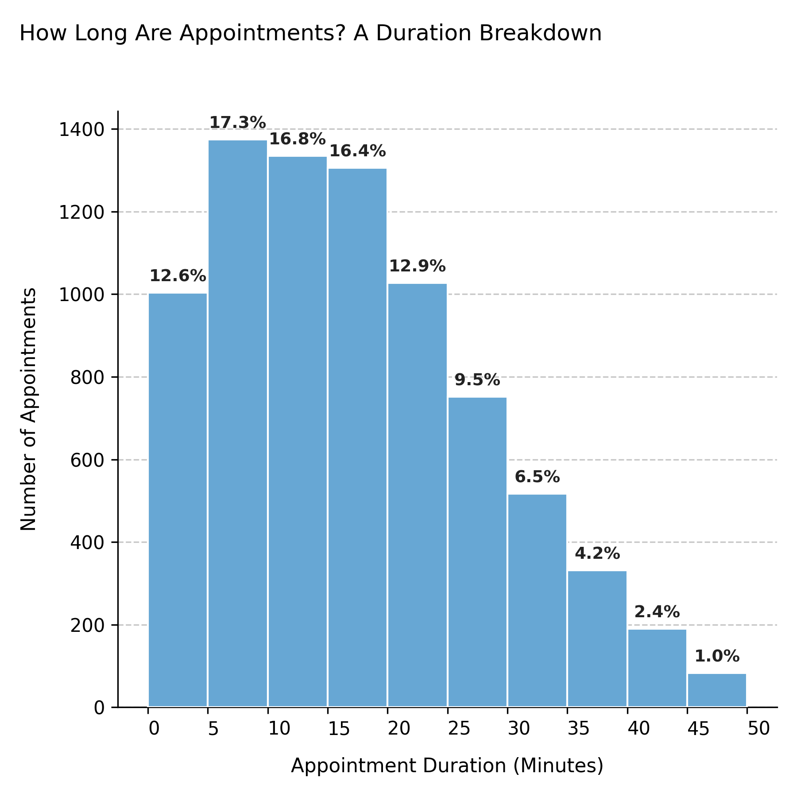

# Visualizing Appointment Duration Distribution

Illustrates the **length of appointments in minutes**, revealing how much time patients typically spend per visit. This visualization helps identify standard session lengths and detect unusual duration patterns in the simulated dataset.

---

## Function Overview
**Function:** `medscheduler.utils.plotting.plot_appointment_duration_distribution(df)`

**Inputs:**
- `df (pd.DataFrame)` — Appointment table containing an `appointment_duration` column (in minutes).

**Returns:** `matplotlib.axes.Axes` — Histogram showing the distribution of appointment durations.

**Validation & error handling:**
- Missing column → raises `ValueError("DataFrame must contain an 'appointment_duration' column.")`.
- All values missing or non-numeric → returns `_empty_plot("No valid data available for 'appointment_duration'.")`.

---

## Output Description
- **X-axis:** Appointment duration (minutes) grouped in 5-minute intervals.
- **Y-axis:** Number of appointments per duration bin.
- **Bars:** Represent the frequency of appointments lasting within each duration range.
- **Color scheme:** Primary Medscheduler blue (`#67A7D4`).
- **Filtering:** Bins representing less than 0.1% of total data are automatically excluded for readability.
- **Annotations:** Displays percentage values above each visible bar.
- **Style:** Clean histogram layout with dashed Y-grid, no top/right spines, and left-aligned title.

This chart provides insight into **service delivery patterns**, helping assess clinic efficiency or verify that simulated durations align with expected operational standards.

---

## Example
```python
from medscheduler import AppointmentScheduler
from medscheduler.utils.plotting import plot_appointment_duration_distribution

# Generate synthetic appointment dataset
sched = AppointmentScheduler()
slots_df, appts_df, patients_df = sched.generate()

# Visualize the duration breakdown of appointments
ax = plot_appointment_duration_distribution(appts_df)
ax.figure.show()  # optional when running interactively
```

**Output preview:**  
The following chart illustrates the distribution of appointment durations, showing how frequently each time interval occurs within the simulated dataset.  



---

## Next Steps
- Compare with waiting time patterns: {doc}`../visualization/plot_waiting_time_distribution`
- Learn how appointment duration is generated: {doc}`../api-reference/appointment_timing`
- Review duration parameters in the appointments table: {doc}`../api-reference/appointments_table`
- Adjust simulation realism through customization: {doc}`../user-guide/customization_options`


