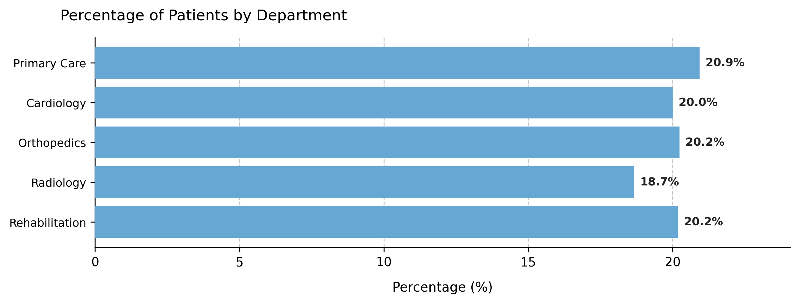

# Visualizing Custom Column Distributions

Displays the **percentage distribution of any categorical attribute** added through the `add_custom_column()` method.  
This visualization allows quick inspection of how auxiliary attributes such as *department*, *clinic type*, or *care pathway* are distributed across the simulated patient registry.

---

## Function Overview
**Function:** `medscheduler.utils.plotting.plot_custom_column_distribution(df, column, ...)`

**Inputs:**
- `df (pd.DataFrame)` — DataFrame containing the custom categorical column (usually `patients_df` or `appointments_df`).
- `column (str)` — Name of the custom column to visualize.
- `title_prefix (str, optional)` — Prefix for the chart title (default: `"Percentage of Patients by"`).  
- `top_n (int, optional)` — Limits display to the top *N* categories (useful for long-tail distributions).  
- `base_height_per_category (float, optional)` — Vertical space allocated per category (default: `0.7`).  
- `min_height`, `max_height (float, optional)` — Bounds for automatic figure height adjustment.

**Returns:** `matplotlib.axes.Axes` — Horizontal bar chart representing the percentage of records per category.

**Validation & error handling:**
- Missing column → `_empty_plot("Column '<name>' not found in DataFrame.")`  
- Empty or invalid column → `_empty_plot("No valid data found in column '<name>'.")`

---

## Output Description
- **Y-axis:** Category labels displayed **top to bottom**, preserving their natural or defined order.  
- **X-axis:** Percentage of total records (`%`).  
- **Bars:** Represent each category’s share in the dataset.  
- **Dynamic height:** The plot automatically scales to fit the number of categories.  
- **Labels:** Each bar shows its percentage value (`xx.x%`).  
- **Color scheme:** Primary Medscheduler blue (`#67A7D4`).  
- **Style:** Horizontal bar layout with dashed X-grid, no top/right spines, and a left-aligned descriptive title.  
- **Order preservation:**  
  If the column is of type `Categorical(ordered=True)`, the bars appear in the exact order of category definition (e.g., `"Primary" → "Specialist" → "Diagnostics" → "Follow-up"`).

This plot is ideal for examining **auxiliary attributes** such as departmental allocation, referral source, or care type, helping verify that custom sampling distributions (e.g., *uniform*, *pareto*, *normal*) behave as expected.

---

## Example
```python
from medscheduler import AppointmentScheduler
from medscheduler.utils.plotting import plot_custom_column_distribution

# Generate synthetic dataset
sched = AppointmentScheduler(seed=99)
sched.generate()

# Add a custom categorical column representing clinic departments
sched.add_custom_column(
    column_name="department",
    categories=["Primary Care", "Cardiology", "Orthopedics", "Radiology", "Rehabilitation"],
    distribution_type="uniform"
)

# Plot the percentage of appointments by department
ax = plot_custom_column_distribution(sched.patients_df, column="department")
ax.figure.show()  # optional when running interactively
```

**Output preview:**  
The following chart displays the relative frequency of appointments across clinical departments. Each bar corresponds to one department, maintaining the configured order and illustrating uniform allocation among patient records.



---

## Next Steps
- Review how custom attributes integrate into {doc}`../api-reference/patients_table`.  
- Learn about random sampling and distribution shapes: {doc}`../api-reference/randomness_and_noise`.  
- Combine with demographic and flow parameters for advanced simulations: {doc}`../examples/custom_columns_examples`.  
- Explore other visualization utilities in {doc}`../visualization/index`.  