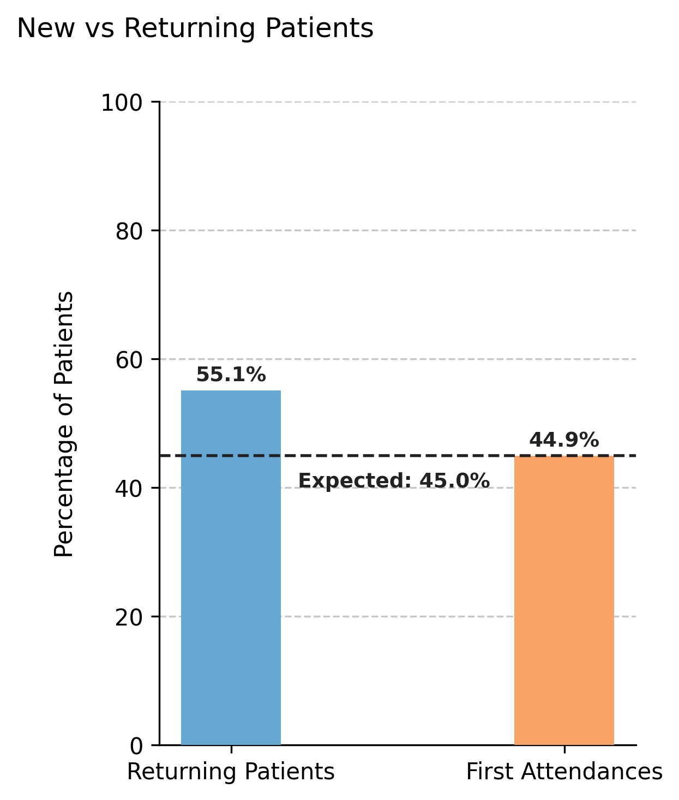

# Visualizing First Attendance Distribution

Illustrates the **observed proportion of first vs. returning attendances** in the simulated dataset, and compares it with the theoretical value configured in the scheduler.  
This plot helps evaluate how closely the generated appointment data aligns with the expected turnover rate defined by the `first_attendance` parameter.

---

## Function Overview
**Function:** `medscheduler.utils.plotting.plot_first_attendance_distribution(df, scheduler, ...)`

**Inputs:**
- `df (pd.DataFrame)` — Appointment table containing at least the columns `patient_id` and `appointment_date`.
- `scheduler (object)` — Instance of `AppointmentScheduler` containing the attribute `first_attendance`, which defines the expected proportion of first attendances.
- `patient_id_col (str, optional)` — Column name identifying patients. Default: `"patient_id"`.
- `appointment_date_col (str, optional)` — Column name identifying appointment dates. Default: `"appointment_date"`.

**Returns:** `matplotlib.axes.Axes` — Bar chart comparing actual and expected proportions of first vs. returning patients.

**Validation & error handling:**
- Missing columns → `_empty_plot("DataFrame must contain columns: patient_id, appointment_date")`.  
- Missing `scheduler.first_attendance` attribute → `_empty_plot("Scheduler must have a 'first_attendance' attribute.")`.  
- Empty dataset → `_empty_plot("No appointment data available.")`.

---

## Output Description
- **Bars:** Represent the real percentages of first attendances and returning patients found in the dataset.  
- **Reference line:** Dashed horizontal line showing the *expected* first attendance proportion (`scheduler.first_attendance × 100`).  
- **Annotations:** Percent values are displayed above each bar, and a small text label marks the configured expectation.  
- **Color scheme:**
  - Returning patients — Primary Medscheduler blue (`#67A7D4`).  
  - First attendances — Secondary orange (`#f9a369`).  
- **Style:** Compact vertical bar layout with dashed Y-grid, no top/right spines, and a left-aligned title.  
- **Y-axis range:** Fixed between 0–100% to standardize comparison across simulations.

This plot is useful for validating **model realism**—confirming that the simulated rate of new vs. returning patients approximates the theoretical configuration.

---

## Example
```python
from medscheduler import AppointmentScheduler
from medscheduler.utils.plotting import plot_first_attendance_distribution

# Generate a dataset
sched = AppointmentScheduler(
    date_ranges=[("2020-09-01", "2025-08-31")],
    ref_date="2025-07-01",
    first_attendance=0.45
)
slots_df, appts_df, patients_df = sched.generate()

# Plot the observed vs expected first attendance ratio
ax = plot_first_attendance_distribution(appts_df, scheduler=sched)
ax.figure.show()  # optional when running interactively
```

**Output preview:**  
The chart below displays the observed percentage of first and returning patients.  
A dashed horizontal line marks the expected 35% first attendance ratio configured in the scheduler.



---

## Next Steps
- Learn more about the `first_attendance` parameter in {doc}`../api-reference/appointment_scheduler`.  
- Analyze yearly variation in first attendances using {doc}`../visualization/plot_first_attendance_by_year`.  
- Explore patient flow and turnover mechanics: {doc}`../api-reference/patient_flow`.  
- Examine attendance outcomes and rebooking patterns: {doc}`../examples/attendance_behavior_and_rebooking`.  

