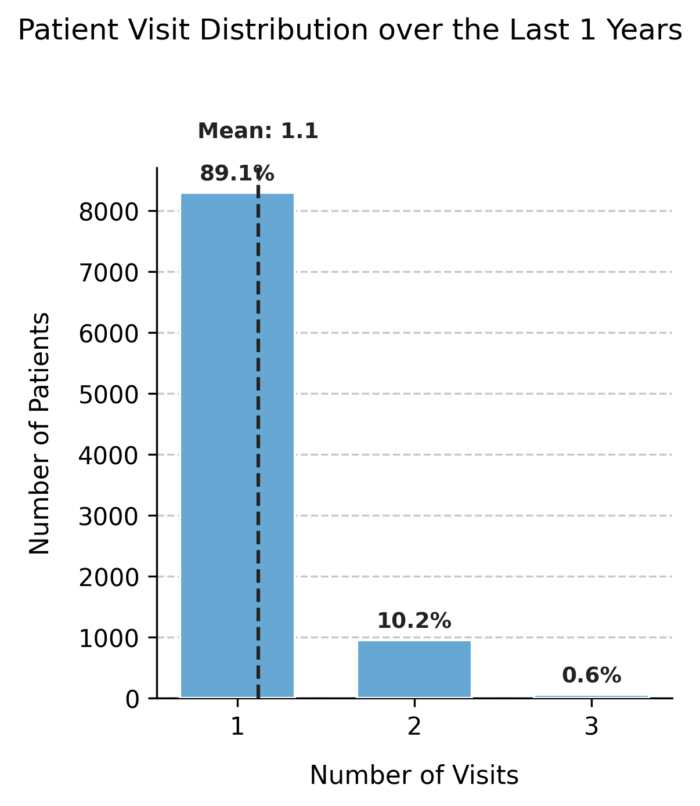

# Visualizing Patient Visit Frequency

Displays the **distribution of patient visit counts** within a defined time window (e.g., the last 1–3 years).  
This visualization helps evaluate the frequency of healthcare utilization among simulated patients and verify that the generated dataset aligns with expected visit patterns.

---

## Function Overview
**Function:** `medscheduler.utils.plotting.plot_patients_visits(df, years_back=1, ...)`

**Inputs:**
- `df (pd.DataFrame)` — Appointment table containing at least the columns `patient_id` and `appointment_date`.
- `years_back (int, optional)` — Number of years before the latest appointment date to include in the analysis. Default is `1`.
- `patient_id_col (str, optional)` — Column name identifying patients. Default: `"patient_id"`.
- `appointment_date_col (str, optional)` — Column name identifying appointment dates. Default: `"appointment_date"`.
- `min_pct_threshold (float, optional)` — Minimum relative frequency (%) required for a bar to be shown. Default: `0.1`.

**Returns:** `matplotlib.axes.Axes` — Bar chart displaying the number of patients by number of visits.

**Validation & error handling:**
- Missing columns → raises `ValueError("DataFrame must contain columns: patient_id, appointment_date")`.  
- Empty dataset or invalid dates → returns `_empty_plot("No appointment data available.")`.

---

## Output Description
- **X-axis:** Number of visits per patient in the specified time window.  
- **Y-axis:** Number of patients who recorded that number of visits.  
- **Bars:** Represent the distribution of patient visit frequencies, filtered by `min_pct_threshold`.  
- **Reference line:** A vertical dashed line marks the **mean number of visits** across all patients.  
- **Annotations:** Each bar displays the percentage of patients in that visit category.  
- **Dynamic width:** The chart width adjusts automatically based on the maximum number of visits.  
- **Style:** Clean grid layout with left-aligned title, dashed Y-grid, and hidden top/right spines.

This plot provides insight into **healthcare utilization intensity**, allowing analysts to detect whether visit frequency follows realistic outpatient patterns (e.g., mostly single visits with a small tail of frequent attenders).

---

## Example
```python
from medscheduler import AppointmentScheduler
from medscheduler.utils.plotting import plot_patients_visits

# Generate dataset
sched = AppointmentScheduler()
slots_df, appts_df, patients_df = sched.generate()

# Visualize visit frequency over the last year
ax = plot_patients_visits(appts_df, years_back=1)
ax.figure.show()  # optional when running interactively
```

**Output preview:**  
The chart shows the distribution of how many visits each patient had within the last year.  
A vertical dashed line indicates the mean number of visits, with percentage labels marking the proportion of patients for each frequency.



---

## Next Steps
- Review how visit counts relate to annual visit parameters in {doc}`../api-reference/appointment_scheduler`.  
- Explore patient-level attributes in {doc}`../api-reference/patients_table`.  
- Analyze how attendance and rebooking modify utilization: {doc}`../examples/attendance_behavior_and_rebooking`.  
- Visualize complementary demographics using {doc}`../visualization/plot_custom_column_distribution`.  

