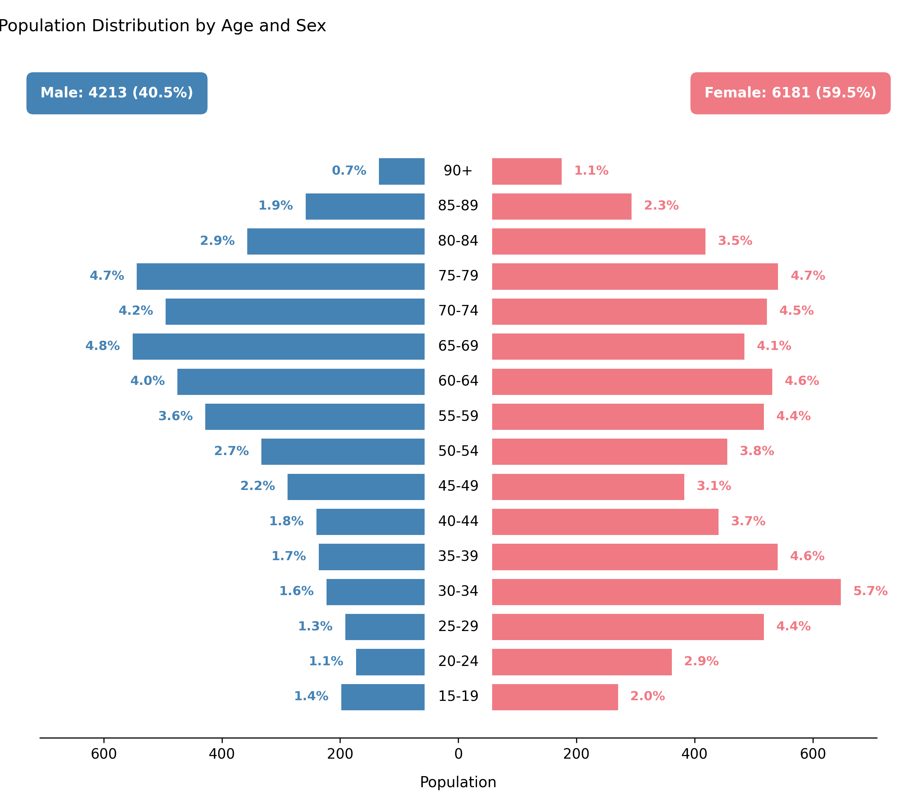

# Visualizing Population Distribution by Age and Sex

Displays a **population pyramid** showing the relative distribution of patients by age group and sex.  
This visualization provides a demographic snapshot of the simulated patient cohort, helping assess whether the generated population matches expected real-world characteristics or custom configuration settings.

---

## Function Overview
**Function:** `medscheduler.utils.plotting.plot_population_pyramid(df, *, age_col='age_group', sex_col='sex', male_label='Male', female_label='Female')`

**Inputs:**
- `df (pd.DataFrame)` — Patient table containing categorical columns for age and sex.
- `age_col (str)` — Column indicating age groups (e.g., `"0–17"`, `"18–29"`, `"30–44"`, etc.). Default: `"age_group"`.
- `sex_col (str)` — Column indicating sex categories. Default: `"sex"`.
- `male_label (str)` — Label representing male patients in `sex_col`. Default: `"Male"`.
- `female_label (str)` — Label representing female patients in `sex_col`. Default: `"Female"`.

**Returns:** `matplotlib.axes.Axes` — Horizontal population pyramid comparing male and female distributions across age groups.

**Validation & error handling:**
- Missing required columns → raises `ValueError("DataFrame must contain columns: age_group, sex")`.
- Missing one of the two sex categories → raises `ValueError("Both 'Male' and 'Female' categories must be present.")`.

---

## Output Description
- **X-axis:** Patient counts (negative for males, positive for females).  
- **Y-axis:** Ordered age groups (bottom = youngest).  
- **Bars:**  
  - Left bars (blue) = male population.  
  - Right bars (pink) = female population.  
- **Center line:** Displays age group labels along the middle axis.  
- **Annotations:**  
  - Each bar labeled with its percentage share of total population.  
  - Total counts and proportions displayed at the top for each sex.  
- **Style:** Balanced dual-sided layout with symmetric scaling, minimalist gridless design, and rounded colored total boxes for clarity.

This plot provides a clear, intuitive view of cohort composition and is particularly valuable for verifying **age–sex balance** in synthetic datasets or studying demographic biases.

---

## Example
```python
from medscheduler import AppointmentScheduler
from medscheduler.utils.plotting import plot_population_pyramid

# Generate synthetic patient cohort
sched = AppointmentScheduler()
slots_df, appts_df, patients_df = sched.generate()

# Visualize demographic distribution
ax = plot_population_pyramid(appts_df)
ax.figure.show()  # optional in interactive sessions
```
**Output preview:**  
The figure below presents a population pyramid showing the age and sex distribution of the simulated patient cohort. Male and female groups are displayed symmetrically to highlight demographic balance across age categories.



---

## Next Steps
- Explore patient demographic generation parameters: {doc}`../api-reference/patient_demographics`
- Review patient flow and attendance logic: {doc}`../api-reference/patient_flow`
- Analyze appointment outcomes by status: {doc}`../visualization/plot_appointments_by_status`
- Adjust demographic distributions via customization options: {doc}`../user-guide/customization_options`


