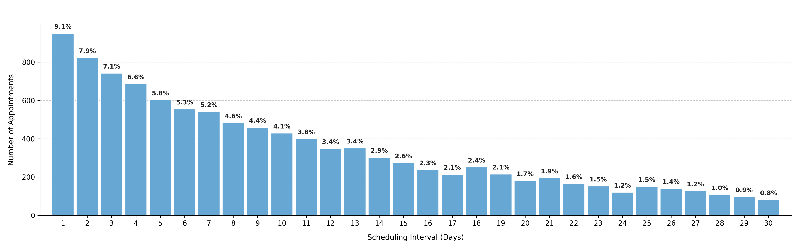

# Visualizing Scheduling Interval Distribution

Shows how far in advance patients tend to schedule their appointments, measured in **days between booking and appointment date**. This distribution highlights patient booking behavior, such as last-minute scheduling versus long-term planning.

---

## Function Overview
**Function:** `medscheduler.utils.plotting.plot_scheduling_interval_distribution(df, *, interval_col='scheduling_interval', min_pct_threshold=0.1)`

**Inputs:**
- `df (pd.DataFrame)` — Appointment table containing the scheduling interval column.
- `interval_col (str)` — Column name containing the number of days between appointment booking and scheduled visit. Default: `"scheduling_interval"`.
- `min_pct_threshold (float)` — Minimum percentage required for a bin to appear in the chart. Default: `0.1` (% of total appointments).

**Returns:** `matplotlib.axes.Axes` — Histogram of appointment scheduling intervals filtered by threshold.

**Validation & error handling:**
- Missing `interval_col` → raises `ValueError("DataFrame must contain column 'scheduling_interval'.")`.
- Empty or all-NaN column → raises `ValueError("No data available in column 'scheduling_interval'.")`.
- After filtering, if no bins exceed the threshold → `_empty_plot("No intervals meet the {threshold}% threshold.")`.

---

## Output Description
- **X-axis:** Scheduling interval in days (integer bins).
- **Y-axis:** Number of appointments per interval.
- **Bars:** Each bar represents the number of appointments scheduled a given number of days in advance.
- **Color scheme:** Primary Medscheduler blue (`#67A7D4`).
- **Labels:** Each bar shows the corresponding percentage of total appointments.
- **Style:** Minimalist design with dashed Y-grid, centered labels, and auto-filtering for rare intervals.

This visualization helps quantify how far in advance patients typically book appointments, identifying operational behaviors such as short-notice scheduling or extended wait times.

---

## Example
```python
from medscheduler import AppointmentScheduler
from medscheduler.utils.plotting import plot_scheduling_interval_distribution

# Generate synthetic appointment data
sched = AppointmentScheduler()
slots_df, appts_df, patients_df = sched.generate()

# Visualize how far in advance patients schedule their visits
ax = plot_scheduling_interval_distribution(appts_df)
ax.figure.show()  # optional when running interactively
```
**Output preview:**  
The histogram below visualizes the distribution of scheduling intervals, showing how many days in advance patients typically book their appointments. Bars represent the number of bookings per interval, annotated with percentage labels for clarity.



---

## Next Steps
- Explore booking horizon and lead time effects: {doc}`../api-reference/booking_dynamics`
- Learn how appointment timing and waiting time interact: {doc}`../api-reference/appointment_timing`
- Compare with arrival punctuality: {doc}`../visualization/plot_arrival_time_distribution`
- Adjust patient behavior parameters: {doc}`../user-guide/customization_options`


