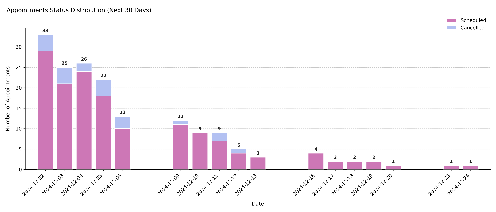

# Visualizing Upcoming Appointment Status Forecast

Shows the **daily distribution of appointment statuses** (typically *scheduled* and *cancelled*) for the upcoming N days after the scheduler’s reference date. This forward-looking plot provides a snapshot of short-term workload and potential cancellations within the booking horizon.

---

## Function Overview
**Function:** `medscheduler.utils.plotting.plot_status_distribution_next_days(df, *, scheduler, days_ahead=30, date_col='appointment_date', status_col='status')`

**Inputs:**
- `df (pd.DataFrame)` — Appointment-level table with at least `date_col` and `status_col` columns.
- `scheduler (AppointmentScheduler)` — Must expose a `ref_date` attribute defining the forecast start.
- `days_ahead (int)` — Number of days ahead of `ref_date` to include in the chart. Default: `30`.
- `date_col (str)` — Column containing appointment dates. Default: `"appointment_date"`.
- `status_col (str)` — Column containing appointment statuses. Default: `"status"`.

**Returns:** `matplotlib.axes.Axes` — Stacked bar chart showing future appointment counts by status per day.

**Validation & error handling:**
- Missing required columns → raises `ValueError("DataFrame must contain columns: …")`.
- Scheduler without `ref_date` → raises `ValueError("Scheduler must have a `ref_date` attribute.")`.
- Empty filtered range → `_empty_plot("No data available in the next N days …")`.
- Column order is explicitly set to `["scheduled", "cancelled"]` to maintain consistency.

---

## Output Description
- **X-axis:** Sequential calendar days from `ref_date` up to `ref_date + days_ahead`.
- **Y-axis:** Number of appointments per day.
- **Bars:** Stacked representation of future appointments by status.
  - Lower bar = *scheduled* appointments (default color `#CD77B6`).
  - Upper bar = *cancelled* appointments (default color `#B3C1F2`).
- **Labels:** Total daily appointment counts displayed above each stacked bar.
- **Grid & style:** Subtle dashed Y-grid, no top/right spines, compact legend above chart.
- **Error policy:** Strict validation — missing inputs raise exceptions (unlike the lenient last-days counterpart).

This visualization supports operational planning by highlighting **expected workload** and **upcoming cancellations**.

---

## Example
```python
from medscheduler import AppointmentScheduler
from medscheduler.utils.plotting import plot_status_distribution_next_days

# Generate synthetic appointment dataset
sched = AppointmentScheduler()
slots_df, appts_df, patients_df = sched.generate()

# Visualize appointment outcomes for the next 30 days
ax = plot_status_distribution_next_days(appts_df, scheduler=sched, days_ahead=30)
ax.figure.show()  # optional in interactive sessions
```
**Output preview:**  
The stacked bar chart below displays the distribution of appointment statuses for the 30 days following the reference date. It highlights how future appointments are categorized (e.g., scheduled vs. cancelled) across each upcoming day.


---

## Next Steps
- Compare with the backward-looking version: {doc}`../visualization/plot_status_distribution_last_days`
- Review future appointment outcome categories: {doc}`../api-reference/attendance_behavior`
- Learn how reference dates and booking horizons interact: {doc}`../api-reference/date_ranges_ref_date`
- Explore future scheduling patterns: {doc}`../api-reference/booking_dynamics`
