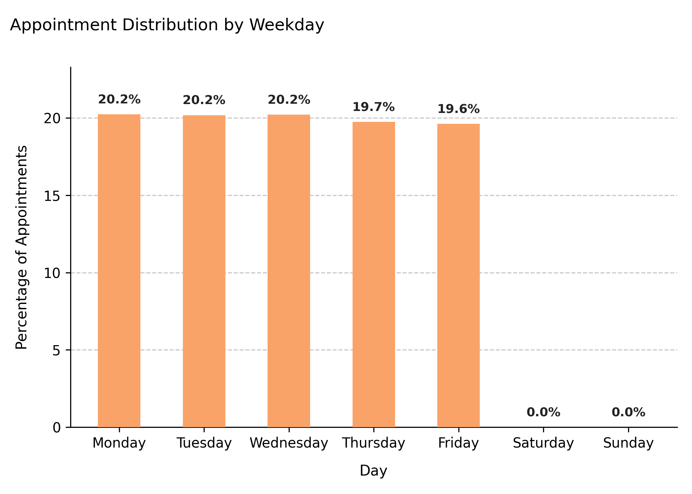

# Visualizing Appointment Distribution by Weekday

Displays the **percentage of appointments by day of the week**, helping to identify which weekdays experience the highest patient activity or service demand. This plot is particularly useful for validating scheduling patterns and operational balance across the week.

---

## Function Overview
**Function:** `medscheduler.utils.plotting.plot_weekday_appointment_distribution(df)`

**Inputs:**
- `df (pd.DataFrame)` — Appointments table containing an `appointment_date` column (datetime-like or convertible).

**Returns:** `matplotlib.axes.Axes` — Bar chart representing the weekday share of total appointments.

**Validation & error handling:**
- Missing `appointment_date` column → raises `ValueError("DataFrame must contain an 'appointment_date' column.")`.
- Non-datetime data in `appointment_date` → coerced to datetime with `pd.to_datetime(errors='coerce')`.

---

## Output Description
- **X-axis:** Ordered weekdays (`Monday` → `Sunday`).
- **Y-axis:** Percentage of total appointments on each weekday.
- **Bars:** Show normalized proportions (0–100%) for each day.
- **Color scheme:** Secondary Medscheduler orange (`#f9a369`).
- **Annotations:** Percentage values displayed above each bar.
- **Style:** Clean grid layout, left-aligned title, no top/right spines, and proportional bar widths for clarity.

This visualization allows administrators or analysts to verify whether appointment load is balanced throughout the week or concentrated on certain days.

---

## Example
```python
from medscheduler import AppointmentScheduler
from medscheduler.utils.plotting import plot_weekday_appointment_distribution

# Generate synthetic appointment data
sched = AppointmentScheduler()
slots_df, appts_df, patients_df = sched.generate()

# Visualize weekday appointment distribution
ax = plot_weekday_appointment_distribution(appts_df)
ax.figure.show()  # optional when running interactively
```
**Output preview:**  
The bar chart below depicts the percentage distribution of appointments across weekdays. It highlights which days of the week have the highest and lowest scheduling activity within the simulated dataset.


---

## Next Steps
- Compare weekday vs. monthly distributions: {doc}`../visualization/plot_monthly_appointment_distribution`
- Understand slot allocation by working days: {doc}`../api-reference/calendar_structure`
- Explore appointment flow and operational patterns: {doc}`../api-reference/patient_flow`
- Review slot-level configuration: {doc}`../api-reference/slots_table`
